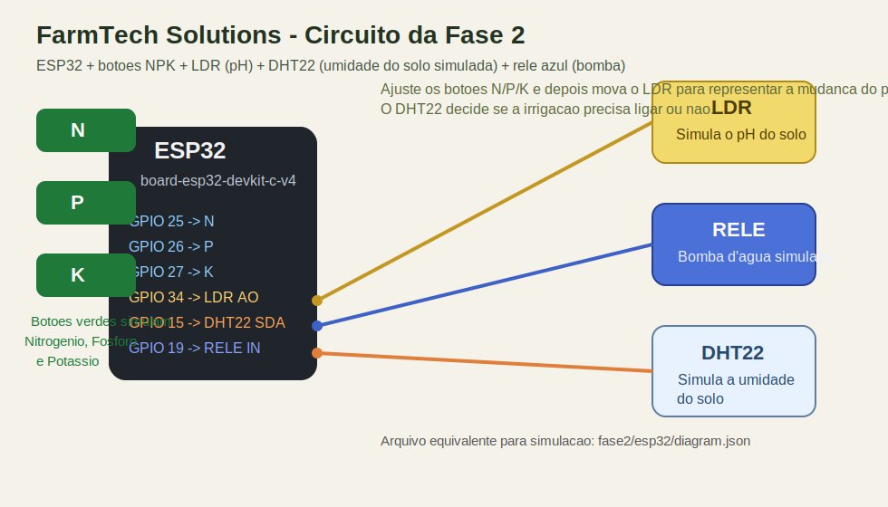

# FarmTech Solutions - Fase 2

Este repositorio mantem os arquivos da Fase 1 na raiz e adiciona uma entrega completa da Fase 2 em `fase2/`, com simulacao no Wokwi, codigo C/C++ para ESP32, integracao opcional com API meteorologica em Python e uma analise opcional em R.

## Estrutura do repositorio

- `main.py`, `calculos.py`, `dados.py`, `estatisticas.R`, `meteorologia.R`: base da fase anterior
- `fase2/esp32/sketch.ino`: logica de irrigacao inteligente para o ESP32
- `fase2/esp32/diagram.json`: circuito da simulacao no Wokwi
- `fase2/esp32/libraries.txt`: biblioteca usada no Wokwi
- `fase2/python/previsao_chuva.py`: consulta de API publica e gera o comando para o Serial Monitor
- `fase2/r/analise_irrigacao.R`: analise estatistica simples com cenarios de sensores
- `fase2/r/cenarios_irrigacao.csv`: base exemplo para o script em R
- `fase2/docs/circuito-fase2.svg`: imagem documentando o circuito usado na Fase 2

## Video de demonstracao

- Demonstracao do sistema: https://youtu.be/E9An0S39GFg

## Cultura escolhida

Foi adotado o **milho**, porque:

- a Embrapa indica que a cultura depende de chuvas constantes ou irrigacao;
- a Embrapa tambem destaca a necessidade de correcao de pH e de fertilidade do solo;
- a cultura responde claramente a disponibilidade de N, P e K, o que combina bem com a simulacao por botoes.

Base tecnica usada para a regra:

- pH desejado: faixa simulada entre **5.5 e 7.0**
- nutrientes: **N, P e K devem estar presentes**
- umidade simulada: abaixo de **55%** significa necessidade de irrigacao
- histerese: a bomba so desliga automaticamente quando a umidade simulada sobe para **65%** ou mais

Observacao importante: o DHT22 mede umidade do ar no Wokwi, mas nesta entrega ele foi assumido didaticamente como **umidade do solo**. O LDR nao mede pH na pratica, entao o seu valor analogico foi apenas convertido para uma escala de **0 a 14**.

## Circuito documentado

Imagem do circuito utilizado:



Tabela de ligacoes:

| Componente | Pino no componente | Pino no ESP32 |
| --- | --- | --- |
| Botao N | `1.l` | `GPIO 25` |
| Botao P | `1.l` | `GPIO 26` |
| Botao K | `1.l` | `GPIO 27` |
| Botoes N/P/K | `2.l` | `GND` |
| LDR | `AO` | `GPIO 34` |
| LDR | `VCC`/`GND` | `3V3`/`GND` |
| DHT22 | `SDA` | `GPIO 15` |
| DHT22 | `VCC`/`GND` | `3V3`/`GND` |
| Rele azul | `IN` | `GPIO 19` |
| Rele azul | `VCC`/`GND` | `3V3`/`GND` |

## Logica da irrigacao

Os tres botoes verdes simulam os nutrientes:

- cada clique no botao alterna entre `OK` e `BAIXO`;
- isso facilita a demonstracao no Wokwi, pois o estado do nutriente fica salvo sem precisar segurar tres botoes ao mesmo tempo.

O LDR simula o pH:

- o codigo le o valor analogico bruto do LDR;
- esse valor e convertido para pH usando a formula `pH = 14 * (1 - ADC / 4095)`;
- no `diagram.json` o LDR foi inicializado com `lux = 100`, para deixar a simulacao perto do pH neutro logo ao iniciar.

O DHT22 simula a umidade do solo:

- se a umidade simulada ficar abaixo de `55%`, o solo e tratado como seco;
- se ela subir para `65%` ou mais, o sistema entende que o solo voltou para uma faixa segura.

Regra final da bomba:

1. Se houver previsao de chuva, o rele fica desligado.
2. Se algum nutriente N/P/K estiver insuficiente, o rele fica desligado.
3. Se o pH estiver fora da faixa 5.5 a 7.0, o rele fica desligado.
4. Se tudo estiver adequado e a umidade estiver abaixo de 55%, o rele liga.
5. Se a bomba ja estiver ligada, ela continua ligada ate a umidade simulada atingir pelo menos 65%.

Essa escolha foi feita para usar todos os sensores pedidos na decisao e evitar irrigacao quando o ambiente quimico estiver fora do padrao escolhido para o milho.

## Como simular no Wokwi

1. Crie um projeto novo com ESP32.
2. Copie `fase2/esp32/sketch.ino` para o `sketch.ino` do projeto.
3. Copie `fase2/esp32/diagram.json` para o `diagram.json`.
4. Copie `fase2/esp32/libraries.txt` para o `libraries.txt`.
5. Rode a simulacao.

Durante a simulacao:

- clique nos botoes `N`, `P` e `K` para alternar o estado dos tres nutrientes;
- clique no DHT22 e altere a umidade para simular solo mais seco ou mais umido;
- ajuste o LDR manualmente para simular a mudanca de pH;
- acompanhe a decisao no Serial Monitor.

Comandos aceitos pelo Serial Monitor:

- `CHUVA=1` -> ativa bloqueio por previsao de chuva
- `CHUVA=0` -> libera irrigacao
- `STATUS` -> imprime um resumo imediato
- `AJUDA` -> mostra os comandos disponiveis

## Compilacao local com arduino-cli

Dependencias usadas para compilar localmente neste ambiente:

- `arduino-cli`
- core `esp32:esp32@1.0.6`
- biblioteca `DHT sensor library for ESPx`
- comando `python` apontando para `python3` no PATH

Exemplo de preparacao do ambiente:

```bash
arduino-cli config init --overwrite
arduino-cli config set board_manager.additional_urls https://espressif.github.io/arduino-esp32/package_esp32_index.json
arduino-cli core update-index
arduino-cli core install esp32:esp32@1.0.6
arduino-cli lib install "DHT sensor library for ESPx"
mkdir -p ~/.local/bin
ln -sf /usr/bin/python3 ~/.local/bin/python
```

Exemplo de compilacao:

```bash
mkdir -p /tmp/farmtech_fase2
cp fase2/esp32/sketch.ino /tmp/farmtech_fase2/farmtech_fase2.ino
arduino-cli compile --fqbn esp32:esp32:esp32 /tmp/farmtech_fase2
```

Resultado esperado:

- uso de flash proximo de `225826 bytes`
- uso de RAM global proximo de `13528 bytes`

## Integracao opcional em Python

O arquivo `fase2/python/previsao_chuva.py` consulta a API publica da Open-Meteo e analisa as proximas horas.

Exemplo:

```bash
python3 fase2/python/previsao_chuva.py --cidade "Sao Paulo" --latitude -23.5505 --longitude -46.6333
```

Saida esperada:

- resumo da chuva prevista nas proximas horas;
- total estimado de precipitacao;
- comando sugerido para o ESP32: `CHUVA=1` ou `CHUVA=0`.

No Wokwi gratuito, a integracao foi feita da forma mais realista para o contexto da disciplina: o Python consulta a API, e o usuario copia o comando gerado para o Serial Monitor do ESP32.

## Analise opcional em R

O arquivo `fase2/r/analise_irrigacao.R` faz uma analise simples sobre cenarios de sensores:

- calcula media, mediana, desvio padrao e quartil da umidade;
- calcula media e desvio padrao do pH;
- aplica a mesma regra de irrigacao do ESP32 ao ultimo registro da base.

Exemplo:

```bash
Rscript fase2/r/analise_irrigacao.R
```

## Fontes tecnicas

- Embrapa, manejo de irrigacao e consumo hidrico do milho verde: https://www.embrapa.br/en/agencia-de-informacao-tecnologica/cultivos/milho/producao/sistemas-diferenciais-de-cultivo/milho-verde
- Embrapa, milho depende de chuvas constantes ou irrigacao e exige correcao de acidez: https://www.embrapa.br/agencia-de-informacao-tecnologica/tematicas/agroenergia/alcool/materias-primas/milho/etanol
- Embrapa, cultivo de milho irrigado com correcao do pH entre 5.5 e 7.0: https://www.infoteca.cnptia.embrapa.br/infoteca/bitstream/doc/1132153/1/CultivoMilhoVerdeIrrigadoBaixadaMaranhense.pdf
- Embrapa, exigencias nutricionais da planta de milho: https://www.embrapa.br/agencia-de-informacao-tecnologica/cultivos/milho/producao/manejo-do-solo-e-adubacao/adubacao-e-fertilidade-do-solo/exigencias-nutricionais-da-planta?_82_languageId=en_US
- Open-Meteo API Docs: https://open-meteo.com/en/docs
